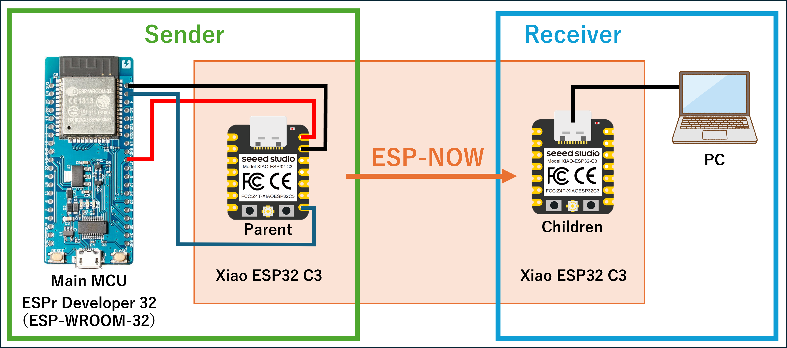

# espnow-uart-bridge
> 本プロジェクトは **ESP-NOW 上の一方向テレメトリ（親機→子機）** を想定しています。
> MCU から親機へ UART で送られた CSV（HDR/DAT）を、親機が ESP-NOW で送信し、
> 子機が受信して PC に CSV で出力します。※ 現時点で uplink/返信は未実装。

Robust **UART → ESP-NOW** telemetry bridge for ESP32 (XIAO ESP32-C3 / ESP32-WROOM-32).
- HDR persistence (NVS) & periodic HDR resend  
- Send queue & inflight limit (NO_MEM 回避)  
- Auto re-init on stall + heartbeat (HB)  
- CRC16 check, LED indicators, CSV 出力（子機）  
- Optional transparent repeater for multi-hop

> **Main programs:** `parent_uart_bridge`（親機） / `child_uart_bridge`（子機）  
> Other sketches under `examples/` & `tools/` are for education and testing.

---

## Why this project?（強み）

本プロジェクトは、**汎用MCUのUART出力を、そのまま高速・低遅延でPCまで橋渡し**するための、実運用を意識した ESP-NOW ブリッジです。研究・教育・競技現場での「落ちない・詰まらない・すぐ診れる」を重視しています。

### 1) 信頼性・復旧性
- **HDR永続化 + 定期再送**：スキーマ（列名）を NVS に保存し、親機/子機の**どちらかが後から復帰**しても自動同期。電源断・リセットに強い。
- **送信キュー + 同時送信(inflight)制御**：UART供給と無線処理の速度差を吸収し、`ESP_ERR_ESPNOW_NO_MEM` を抑制。
- **自動再初期化（[REINIT]）**：無線が詰まったら `esp_now_deinit → wifi stop/start → set_channel → esp_now_init → add_peer` を自動実行し、リンクを自己修復。
- **CRC16-CCITT**：空間での誤りを検知し、破損フレームを捨てて**クリーンなCSV**を保証。
- **ハートビート(HB) + STAT**：シリアルの `[STAT]` で**スループットやドロップ**を一目で確認。

### 2) シンプル & 相互運用
- **テキストCSVで合意、空中は効率的なバイナリ**：MCU↔親機は読みやすい `HDR/DAT`（CSV）、空中は `NowFrame`（バイナリ）で効率化。
- **スキーマ非依存**：`fields=` の**列名の順序が仕様**。どんなデータ構成でも同じ器で運べます（IMUや操舵、バッテリー等）。
- **可搬性**：XIAO ESP32-C3 / ESP32-WROOM-32 など**Arduino-ESP32 v3 / ESP-IDF v5 世代**で動作確認済み。

### 3) 性能・運用のしやすさ
- **低遅延・実用スループット**：DAT は連続50 Hz（例）で安定搬送。項目数やビットレートに応じた**バックプレッシャ**設計。
- **ESP-NOW LR対応（任意）**：遠距離・低レート向けに Long Range を切替（双方同時に有効化）。チャネル固定運用で**安定リンク**。

### 4) デベロッパ体験
- **即デバッグ**：`yourMCU_uart_demo` でヘッダとダミーデータを**即出力**。配線図（`docs/assets/Wiring_Diagram.png`）とデモ動画で**立ち上げ容易**。
- **Live可視化ツール（Python）**：`host/python/apps/viewer.py`  
  - HDR自動追従、CSVロギング、**自動Y軸スケーリング（余白/スムージング/0含む切替）**、シリアル自動再接続。
  - 依存最小（`pyserial` + `matplotlib`）、`requirements.txt` あり。

### 5) 拡張性
- **データ定義の追加/差し替えが容易**：`fields=` の列名合意だけで、学生側MCUの**実装自由度**が高い。
- **安全な進化**：ACK/再送・圧縮・暗号化・タイム同期（例：親機から時刻配布）などの拡張ポイントを**明示的に分離**。

> 要するに：**壊れにくく、直せて、見える**。そして**誰のMCUでも乗せ替えやすい**テレメトリの土台です。


## Wiring



> [!IMPORTANT]
> **Sender**: Your main MCU → **Parent**(ESP32) via UART
> 
> **Link**: Parent → **Child** via ESP-NOW (same channel)
> 
> **Receiver**: Child → PC via USB (CSV)

---

## Demo (video)


*Shown:* `examples/yourMCU_uart_demo/yourMCU_uart_demo.ino` → `firmware/bridge/parent_uart_bridge` → `firmware/bridge/child_uart_bridge` のシリアル出力挙動（Arduino IDE）。

---

## Repository layout

```
docs/ — ドキュメント類（配線図・デモ動画などを格納）
  assets/
    esp_now_demo.gif
    python_graph.gif
    Wiring diagram.pptx
    Wiring_Diagram.png
  glossary.md
  overview.md
  packet-format.md

examples/ — your MCU に書き込むデモ用プログラム
  yourMCU_uart_demo/
    yourMCU_uart_demo.ino
  README.md

firmware/ — メイン：ESP-NOW UART ブリッジ（espnow-uart-bridge）のプログラム群
  bridge/ — 親機・子機ブリッジのスケッチ
    child_uart_bridge/
      child_uart_bridge.ino
    parent_uart_bridge/
      parent_uart_bridge.ino

host/ — Python 製ホストソフトウェア・デモプログラム（可視化・データ解析用）
  python/
    apps/
       viewer.py — センサデータのリアルタイムビューア
       requirements.txt — 依存ライブラリ一覧

tools/ — 動作確認ツール（MACアドレスチェックなど）
  MAC_Check/ — MACアドレス確認用プログラム
    mac_check/
      mac_check.ino

README.md
```


---

## Quick start

1. **Child (receiver)**  
   - Flash `firmware/bridge/child_uart_bridge/child_uart_bridge.ino`  
   - Open Serial @ **115200** → CSVが流れたらOK

2. **Parent (bridge)**  
   - Flash `firmware/bridge/parent_uart_bridge/parent_uart_bridge.ino`  
   - 設定するもの：
     - `peerMac[]` → **子機の STA MAC**（`WiFi.macAddress()`）
     - `CHANNEL` → 子機と同じ（例: `1`）
     - XIAO ESP32-C3 の UART: **RX=D7(GPIO20)**、TXは未使用でOK  
   - Serial @ **115200** で `[STAT]` や `[REINIT]` ログを確認

3. **Sender (your MCU or demo)**  
   - すぐ試すなら `examples/yourMCU_uart_demo/yourMCU_uart_demo.ino` を別のESP32に書き込み  
     - 出力例  
       - `HDR,1,GLDR,fields=dt_ms,ax,ay,az,gx,gy,gz,ail,elv,rud,batt,temp,rate=50`（起動時）  
       - `DAT,<seq>,<t_ms>,<dt_ms>,ax,ay,az,gx,gy,gz,ail,elv,rud,batt,temp`（50Hz）  
   - 実機MCUからは同じ CSV 形式で UART 送信すれば、そのまま橋渡しされます

> [!IMPORTANT]
> **全ノード同一チャネル必須。** LR を使う場合は **親/子/中継**すべてで `USE_WIFI_LR` を同時に有効化。

> [!TIP]
> 親機：firmware/bridge/child_uart_bridge
> 
> 子機：firmware/bridge/parent_uart_bridge
> 
> 滑空機のマイコン：examples/yourMCU_uart_demo
---

## Configuration (parent / child)

**parent_uart_bridge**
```cpp
// Channel must match child
const int CHANNEL = 1;

// Use child STA MAC (not AP MAC)
const uint8_t peerMac[6] = { 0x58, 0xCF, 0x79, 0xF3, 0xC8, 0xB4 };

// Queue / rate control
#define Q_CAP           256      // send queue depth
#define MAX_INFLIGHT    6        // concurrent sends (avoid NO_MEM)
#define PAYLOAD_MAX     220      // safe payload (ESP-NOW ~250B max)
#define HDR_PERIOD_MS   5000     // periodic HDR resend for self-sync

// Optional LR (enable on both ends)
// #define USE_WIFI_LR
```

**child_uart_bridge**
```cpp
#define SERIAL_BAUD 115200
const int CHANNEL = 1;     // must match parent
// #define USE_WIFI_LR
// Require HDR before DATA? (0=accept DATA anyway / 1=HDR required)
#define REQUIRE_HDR 0
```

**yourMCU_uart_demo**（デモ）
```cpp
// Outgoing UART to parent
HardwareSerial& OUT = Serial1;
const int OUT_TX = 23;     // change to your board pin
const unsigned OUT_BAUD = 115200;

// Sampling rate
// (rename HZ→SAMPLE_RATE_HZ if your toolchain defines HZ macro)
const uint32_t HZ = 50;
```

---

## Protocol (brief)

- **UART (text)**  
  - `HDR,1,GLDR,fields=<comma-separated-names>[,rate=…]`  
  - `DAT,<src_seq>,<t_ms>,<values...>`（デモでは `<dt_ms>` を含む）
- **Over the air (ESP-NOW, binary)**  
  - `NowFrameHdr{ ver=1, type(1=HDR/2=DATA/3=HB), node_id, tx_seq, payload_len, crc16 }`  
  - `HDR payload{ schema_id(FNV-1a 16bit), fields_len, fields[] }`  
  - `DATA payload{ schema_id, src_seq, t_ms, value_count, float[value_count] }`  
  - CRC16-CCITT(0x1021)

> 子機は CRC を検証し、CSVへ復元して `Serial.println`。`REQUIRE_HDR` で厳格運用も可能。

---

## Reading the logs

- 親機 `[STAT]`:  
  `UART=<B/s>  Q=<depth>/<cap> drop=<n>  HDR=<n> DAT=<n>  TX ok=<n> fail=<n> inflight=<n>`
  - `TX ok=1` のみ増えるときは **HBだけ**通っている状態（子機はHBを表示しません）
- 親機 `[REINIT] restarting WiFi/ESP-NOW...`：  
  **リンク詰まり自動復旧**。`esp_now_deinit→wifi stop/start→set_channel→esp_now_init→add_peer` を実行

---

## Troubleshooting

- 子機に何も出ない → 親機が **HDR未取得**の可能性  
  - デモは5秒おきに HDR 再送（数秒で復帰）  
  - 親機は NVS の HDR を起動直後に再送する設計  
- MAC が `00:00:...` → Wi-Fi 初期化順序を確認  
  `mode → wifi_start → set_channel → (LR) → esp_now_init → add_peer`
- `ESP_ERR_ESPNOW_NO_MEM` 多発 → `MAX_INFLIGHT` を下げる、レート/項目数の見直し
- `peerMac` は **子機の STA MAC** を使う（AP MAC ではない）
- 配線：TX→RX、**GND 共通**、115200bps、行末は `println`

---

## Host-side

`host/python/apps/viewer.py`：  
- UART からの CSV をリアルタイム可視化・記録（`pyserial`, `pandas`, `matplotlib/pyqtgraph`, `rich`, `typer`）  
- ポート選択、保存、プロット対象フィールド、ダウンサンプリング、HDR追従


---

## License

MIT

## Acknowledgements

- **Espressif Systems** — for ESP-NOW and ESP-IDF / Arduino-ESP32.
- **Arduino-ESP32 core maintainers** — for maintaining the ESP32 Arduino core.
- **Seeed Studio** — for XIAO ESP32-C3 board support and documentation.
- **M5Stack** — for M5StickC / M5Atom libraries and examples (used in IMU demos).
- **References** — ESP-NOW overview video (YouTube): https://www.youtube.com/watch?v=bEKjCDDUPaU
- **Contributors / Testers** — thanks to everyone who helped with experiments and validation.

